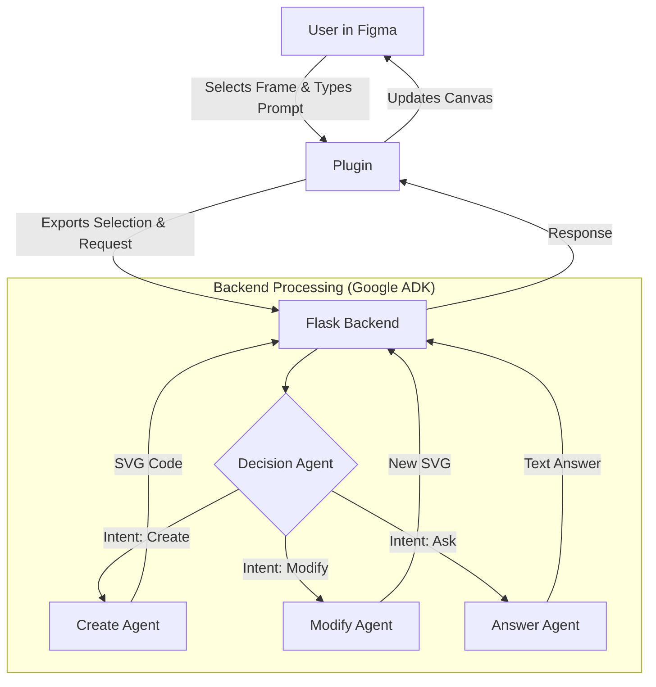

# Designo - AI-Powered Figma Assistant 🎨


**Turn your text prompts into editable UI elements instantly.**

Designo is a next-generation Figma plugin that leverages Google's Agent Development Kit (ADK) and Gemini models to act as your intelligent design partner. Whether you need to generate new SVG icons, modify existing UI based on context, or ask complex design questions, Designo handles it all within the Figma canvas.

---

## 📹 Demo

> **[Click here to watch the full video demonstration](./Video%20And%20PPT/demo.mp4)**
> *(Right-click and 'Save Link As' to download if it doesn't play in browser)*

<!-- PRO TIP: To make your repo truly discoverable, record a GIF of the plugin in action and replace the line above with:  -->

---

## 📑 Table of Contents
- [Features](#-features)
- [How It Works](#-how-it-works-architecture)
- [Tech Stack](#-tech-stack)
- [Prerequisites](#-prerequisites)
- [Installation & Setup](#-installation--setup)
- [Usage Guide](#-usage-guide)
- [Contributing](#-contributing)

---

## ✨ Features

*   **🧠 Context-Aware Intelligence:** The AI automatically detects if you are trying to create a new element (empty frame selected) or modify an existing one.
*   **🎨 Text-to-SVG Generation:** Describe a UI element (e.g., "A user profile card with a logout button"), and Designo generates the vector code instantly.
*   **🖌️ Visual Modification:** Select an element and ask for changes (e.g., "Make the button rounded and blue"). Designo "sees" your design and adjusts the code.
*   **💬 Integrated Chat & QA:** Ask general design questions (e.g., "What are trending fonts for 2025?") and get answers powered by Google Search.
*   **🤖 Multi-Agent System:** Specialized AI agents handle routing, generation, modification, and research separately for optimal performance.

---

## ⚙️ How It Works (Architecture)

Designo uses a split architecture to keep the plugin lightweight while handling heavy AI processing on a Python backend.



1.  **Figma Plugin (Frontend):** Handles user selection, image export (for context), and rendering the chat interface.
2.  **Flask Backend:** Uses Google's Agent Development Kit to route requests to specialized Gemini models.
3.  **Google Gemini:** The core intelligence engine that generates SVG code or text responses.

---

## 🛠 Tech Stack

*   **Frontend:** HTML5, CSS3, JavaScript (Figma Plugin API)
*   **Backend:** Python 3.8+, Flask
*   **AI/ML:** Google Agent Development Kit (ADK), Google Gemini Pro, Google Gemini Pro Vision
*   **Tools:** Node.js (for dependency management)

---

## 📋 Prerequisites

Before running Designo, ensure you have the following installed:

*   [Node.js & npm](https://nodejs.org/)
*   [Python 3.8+](https://www.python.org/)
*   [Figma Desktop App](https://www.figma.com/downloads/)
*   **Google API Key:** Get one from [Google AI Studio](https://aistudio.google.com/app/apikey).

**Local mode note:** This fork does not require Firebase or user login. The plugin opens directly in local mode and sends prompts to the local Flask backend. The backend still needs a Gemini API key configured with `GOOGLE_API_KEY` or pooled keys such as `GOOGLE_API_KEY_0`.

---

## 🚀 Installation & Setup

### 1. Clone the Repository
```bash
git clone https://github.com/atharva9167j/Designo.git
cd Designo
```

### 2. Backend Setup
Set up the Python Flask server to handle AI requests.
```bash
cd Backend

# Create Virtual Environment
python -m venv venv

# Activate Virtual Environment
# Windows:
venv\Scripts\activate
# macOS/Linux:
source venv/bin/activate

# Install Dependencies
pip install Flask Flask-Cors google-adk

# Configure API Key
# Create a .env file in the Backend folder
echo 'GOOGLE_API_KEY="YOUR_ACTUAL_API_KEY"' > .env
```

### 3. Plugin Setup
Prepare the Figma interface.
```bash
cd ../Plugin
npm install
# Ensure 'dist/code.js' exists or run build script if available
```

---

## 🎮 Usage Guide

1.  **Start the Backend:**
    Run `python app.py` inside the `Backend` folder. Ensure it's running on port `5001`.

2.  **Import to Figma:**
    *   Open Figma Desktop App.
    *   **Plugins > Development > Import plugin from manifest...**
    *   Select `manifest.json` inside the `Plugin` folder.

3.  **Run the Plugin:**
    *   **Create Mode:** Select an empty top-level Frame. Type: *"Create a login form"* -> **Send**.
    *   **Modify Mode:** Select an element inside a frame. Type: *"Change the background to dark mode"* -> **Send**.
    *   **Q&A Mode:** Select nothing. Type: *"What is a good color palette for healthcare apps?"* -> **Send**.

---

## 🤝 Contributing

Contributions are what make the open-source community such an amazing place to learn, inspire, and create. Any contributions you make are **greatly appreciated**.

1.  Fork the Project
2.  Create your Feature Branch (`git checkout -b feature/AmazingFeature`)
3.  Commit your Changes (`git commit -m 'Add some AmazingFeature'`)
4.  Push to the Branch (`git push origin feature/AmazingFeature`)
5.  Open a Pull Request

---

## 📝 License

Distributed under the MIT License. See `LICENSE` for more information.
